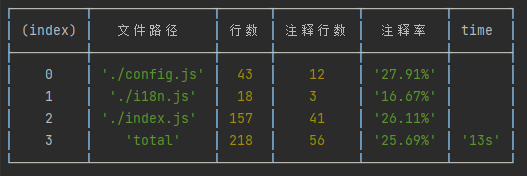

# ✨ 注释率统计工具（支持国际化）
- 前端项目注释率统计（支持国际化）
- 目前仅支持英语和中文（Only English and Chinese are supported.）
- 作者/Author: Neo (001@usd.dog)

## ⚙ 用法 Usage

## 标准运行 Common Run
```javascript
// 引入包
const commentCount = require('commentCount');
// 标准运行
commentCount.run();

```

## 带参数运行 Run with arg
```javascript
// 引入包
const commentCount = require('commentCount');
// 带参数运行
const filterList = [
    './node_modules',
];
// 指定统计某些类型的文件
const countType = ['.js', 'ts'];
const config = {
    filterList, countType
}
/**
 * @param dir 需要统计的项目目录， 统计当前目录：./
 * @param config 配置文件
 *  @param config.filterList 需要过滤的文件夹和文件，可以不提供，默认添加了javascript项目常见的过滤目录
 *  @param config.countType 需要统计的文件类型，默认为['.js','.jsx','.ts','.tsx','.vue']
 * @description 默认配置，请看包目录下的./config/config.js
 * @description 支持国际化，请修改包目录下的./lib/i18n.js配置文件
 * **/
commentCount.run('./', config);

```

# 📝 默认过滤规则 Default filter rules
- 当不提供过滤列表时，工具会默认使用以下过滤配置
- 过滤了大部分的业务无关的文件

```javascript
filterList = [
    './node_modules',
    './.vscode',
    './.idea',
    './husky',
    './.git',
    './.tscache',
    './.eslintrc.js',
    './.stylelintrc.js',
    './jest.config.js',
]
```

# 配置npm run count
 - 在package.json中添加scripts
```javascript
{
    // ......
    scripts: {
        // 配置执行的脚本
        // 案例为： 统计当前目录下：./ 的所有.js .ts文件， 第一个参数为路径， 其余参数为文件类型 ， 使用空格间隔
        "count": "node ./node_modules/commentcount/index.js ./ .js .ts"
    }
    // ......
}
```
- 添加上述配置后，执行：
```bash
npm run count
```
- 结果：Result



> `Base on MIT, Feel free to use anywhere you want.`

> `Apperiate if you mention the origin link when using it.`
